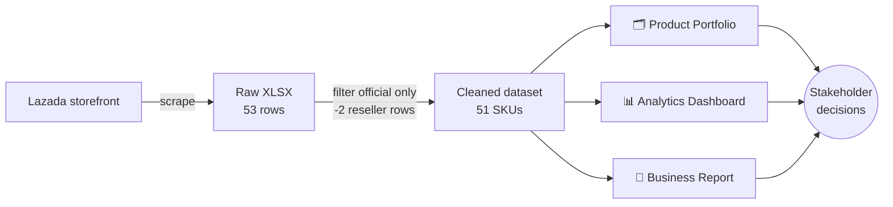

<div align="center">

# MN+LA — Lazada Business Analytics

**A full analyst workflow, end to end: scraped marketplace data → cleaned dataset → interactive catalog → analytics dashboard → written business recommendations.**


[Portfolio](portfolio/) · [Dashboard](dashboard/) · [Business Report](reports/business_analysis.md) · [Dataset](data/mnla_official_products.csv)

</div>

---

## Table of Contents

- [Overview](#overview)
- [Pipeline](#pipeline)
- [At a Glance](#at-a-glance)
- [Category Performance](#category-performance)
- [Top Sellers](#top-sellers)
- [Key Findings](#key-findings)
- [Repo Structure](#repo-structure)
- [Running Locally](#running-locally)
- [Publishing to GitHub Pages](#publishing-to-github-pages)
- [Data Source & Caveats](#data-source--caveats)

---

## Overview

**MN+LA** is a Manila-based streetwear brand. This project scrapes its official storefront on Lazada Philippines and turns the raw listings into three deliverables a business stakeholder can actually use:

| Deliverable | Purpose |
|---|---|
| 🗂️ [**Product Portfolio**](portfolio/) | Browsable catalog — search, filter by category, sort by price / rating / best-sellers |
| 📊 [**Analytics Dashboard**](dashboard/) | KPIs and charts across sales, pricing, ratings, and categories — tabbed, fixed-viewport, zero scrolling |
| 📄 [**Business Report**](reports/business_analysis.md) | Narrative findings, data caveats, and concrete recommendations |

---

## Pipeline



---

## At a Glance

<div align="center">

| Official SKUs | Total Units Sold | Avg. Price | Avg. Rating | Total Reviews |
|:---:|:---:|:---:|:---:|:---:|
| **51** | **688** <sub>(12 SKUs reporting)</sub> | **₱1,135** <sub>(₱50–₱4,570)</sub> | **4.64 ★** <sub>(13 SKUs rated)</sub> | **215** |

</div>

> Sales and rating fields are only populated for a subset of the catalog (~24–25%) — treat these as a visible sample, not the full picture. See [caveats](#data-source--caveats).

---

## Category Performance

| Category | SKUs | Avg. Price | Total Units Sold | Avg. Rating |
|---|:---:|---:|---:|:---:|
| Men's Clothing | 21 | ₱1,217.6 | 225 | 4.4 ★ |
| Fashion Accessories | 13 | ₱1,146.9 | 163 | 5.0 ★ |
| Sports Shoes and Clothing | 10 | ₱823.0 | 0 | 5.0 ★ |
| Men's Shoes | 2 | ₱3,020.0 | 7 | — |
| Lingerie, Sleep, Lounge & Thermal Wear | 2 | ₱485.0 | 187 | 4.7 ★ |
| Beauty | 1 | ₱1,070.0 | 106 | 4.8 ★ |
| Pet Supplies | 1 | ₱1,070.0 | 0 | — |
| Toys & Games | 1 | ₱50.0 | 0 | — |

<sub>Men's Clothing leads on both SKU count and total units sold; Sports Shoes/Accessories carry meaningful catalog share but little recorded sales traction.</sub>

---

## Top Sellers

| Rank | Product | Price | Units Sold | Rating |
|:---:|---|---:|---:|:---:|
| 1 | MN+LA™ Bandana (3 Colorways) | ₱370 | 150 | 5.0 ★ |
| 2 | Classic Tee (4 Colorways) | ₱770 | 129 | 5.0 ★ |
| 3 | Boxer Brief Bundle of 3 (4 Colorways) | ₱770 | 107 | — |
| 4 | MN+LA™ Parfum 50ml (4 Scents) | ₱1,070 | 106 | 4.8 ★ |
| 5 | MN+LA Sock – Single (4 Colorways) | ₱200 | 80 | 4.7 ★ |

<sub>Every visible best-seller sits at or below ₱1,070 — see [Key Findings](#key-findings) for what that implies about pricing.</sub>

---

## Key Findings

<details open>
<summary><strong>💰 Price and sales trend inversely</strong></summary>
<br>

r ≈ −0.55 among the 12 SKUs with sales data. The best sellers cluster in the ₱200–₱770 range, while SKUs above ₱1,500 show almost no visible sales traction.
</details>

<details>
<summary><strong>🏷️ No discounting exists</strong></summary>
<br>

0 of 51 SKUs carry a discounted price. Given the price/sales relationship above, testing promos on higher-priced items is the clearest untapped lever.
</details>

<details>
<summary><strong>📦 Category mismatch</strong></summary>
<br>

Sports Shoes/Clothing + Fashion Accessories make up 45% of the catalog by SKU count but show comparatively little recorded sales, while Men's Clothing basics dominate both units sold and revenue proxy.
</details>

<details>
<summary><strong>🔍 Data is sparse, not necessarily bad</strong></summary>
<br>

Only ~24% of SKUs report sales figures and ~25% have ratings. Conclusions here are directional signals from a small visible sample, not statistically robust trends across the whole catalog.
</details>

Full detail, methodology, and recommendations live in [`reports/business_analysis.md`](reports/business_analysis.md).

---

## Repo Structure

```
MN-LA_Lazada-BusinessAnalytics/
├── portfolio/              # Browsable product catalog (HTML/CSS/JS)
├── dashboard/              # Tabbed analytics dashboard (HTML/CSS/JS + Chart.js)
├── reports/
│   └── business_analysis.md
├── data/
│   └── mnla_official_products.csv
└── README.md
```

---

## Running Locally

Both sites are static — plain HTML/CSS/JS, no build step, no dependencies to install.

```bash
cd portfolio && python -m http.server 8118   # → http://localhost:8118
cd dashboard && python -m http.server 8119   # → http://localhost:8119
```

## Publishing to GitHub Pages

1. Repo **Settings → Pages** → source: `main` branch, root folder.
2. Serve `portfolio/index.html` and `dashboard/index.html` directly, or wire up custom Pages routing for subpaths.

---

## Data Source & Caveats

Data was collected via a Lazada Philippines scraper against MN+LA's official storefront on **2026-07-06**. It reflects a **single point-in-time snapshot from one marketplace/region** — see the caveats section in the [business analysis report](reports/business_analysis.md) before drawing broader conclusions.

<div align="center">
<sub>MN+LA — Manila meets LA.</sub>
</div>
